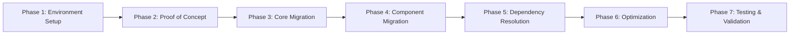

# ProxyDeck: React to Preact Migration Plan

## Executive Summary

This document outlines a comprehensive plan for migrating ProxyDeck from React 19.1.0 to Preact, focusing on reducing bundle size and improving performance while maintaining full functionality through compatibility layers.

### Key Findings
- **Potential bundle size reduction**: ~160KB (89% reduction in React library size)
- **Current total bundle sizes**: Options: 483KB, Popup: 388KB (both exceed 244KB limit)
- **Expected post-migration sizes**: Options: ~300KB, Popup: ~200KB
- **Overall feasibility**: MODERATE TO HIGH with specific dependency risks

## Table of Contents
1. [Current State Analysis](#current-state-analysis)
2. [Migration Strategy](#migration-strategy)
3. [Technical Implementation](#technical-implementation)
4. [Risk Assessment & Mitigation](#risk-assessment--mitigation)
5. [Alternative Approaches](#alternative-approaches)
6. [Timeline & Resources](#timeline--resources)
7. [Success Metrics](#success-metrics)
8. [Rollback Plan](#rollback-plan)

## Current State Analysis

### Bundle Size Breakdown

#### JavaScript Bundle Sizes (Chrome Build)
```
vendor-charts.js    467KB  (recharts, d3, lodash)
vendor-react.js     180KB  (react, react-dom, scheduler)
background.js       152KB  (core background logic)
vendor-ui.js         71KB  (Radix UI components)
vendor-dnd.js        46KB  (@dnd-kit drag-and-drop)
vendor-common.js     35KB  (shared vendor code)
shared-components.js 28KB  (shared app components)
popup.js             27KB  (popup entry point)
options.js           76KB  (options entry point)
```

#### Entry Point Totals
- **Options Page**: 483KB (97% over recommended limit)
- **Popup**: 388KB (59% over recommended limit)
- **Background**: 152KB (single chunk, no splitting)

### React Usage Analysis

#### React Version & Features
- **Version**: React 19.1.0 (latest)
- **Modern Features Used**:
  - `createRoot` API
  - Suspense & React.lazy() for code splitting
  - forwardRef in all UI components
  - StrictMode enabled

#### Hooks Usage
- **Core Hooks**: useState, useEffect, useCallback, useRef, useMemo
- **Custom Hooks**: useProxyToggle, useThemeIcon, useToast

#### Dependencies Requiring React
1. **UI Framework**: 
   - @radix-ui/* (11 packages) - Headless UI components
   - class-variance-authority - Component variants
   
2. **Data Visualization**:
   - recharts - Real-time traffic charts
   
3. **Drag & Drop**:
   - @dnd-kit/core, @dnd-kit/sortable - Sortable proxy lists

4. **Testing**:
   - @testing-library/react
   - React-specific testing utilities

### Performance Characteristics
- Initial load times impacted by large bundle sizes
- Chrome Web Store warnings about bundle size
- Service worker constraints for Manifest V3

## Migration Strategy

### Phased Approach



### Phase 1: Environment Setup (2-3 days)

#### 1.1 Install Preact Dependencies
```bash
npm install preact
npm install --save-dev @preact/compat
```

#### 1.2 Webpack Configuration Updates
```javascript
// webpack.config.js modifications
module.exports = (env) => {
  return {
    resolve: {
      alias: {
        // Add Preact aliases
        "react": "preact/compat",
        "react-dom/test-utils": "preact/test-utils",
        "react-dom": "preact/compat",
        "react/jsx-runtime": "preact/jsx-runtime",
        // Keep existing aliases
        '@browser-polyfill': 'webextension-polyfill',
        '@/components': path.resolve(__dirname, 'src/components/'),
        '@/lib': path.resolve(__dirname, 'src/lib/'),
      }
    },
    // Update optimization for Preact
    optimization: {
      splitChunks: {
        cacheGroups: {
          // Replace react group with preact
          preact: {
            test: /[\\/]node_modules[\\/](preact)[\\/]/,
            name: 'vendor-preact',
            chunks: (chunk) => chunk.name !== 'background',
            priority: 40,
            enforce: true
          },
          // Keep other groups but test for compatibility
        }
      }
    }
  };
};
```

#### 1.3 TypeScript/JSDoc Configuration
```javascript
// jsconfig.json updates
{
  "compilerOptions": {
    "paths": {
      "react": ["./node_modules/preact/compat/"],
      "react-dom": ["./node_modules/preact/compat/"]
    }
  }
}
```

### Phase 2: Proof of Concept (3-4 days)

#### 2.1 Migrate Popup Component First
The popup is the simplest entry point with fewer dependencies:

```javascript
// src/popup.js - Updated entry point
import { render } from 'preact';
import { PopupApp } from './pages/popup/PopupApp';

// Replace createRoot pattern
const container = document.getElementById('popup-root');
render(<PopupApp />, container);
```

#### 2.2 Test Core Functionality
- Proxy toggle functionality
- WebExtension message passing
- State management
- Theme detection

#### 2.3 Validate Bundle Size Reduction
```bash
# Build and measure
npm run build:chrome
# Compare popup.js size before/after
```

### Phase 3: Core Migration (1 week)

#### 3.1 Update All Entry Points
```javascript
// src/options.js
import { render } from 'preact';
import { OptionsApp } from './pages/options/OptionsApp';

render(<OptionsApp />, document.getElementById('options-root'));
```

#### 3.2 Convert React-specific Patterns

**forwardRef Pattern Update**:
```javascript
// Before (React)
const Button = React.forwardRef(({ className, ...props }, ref) => {
  return <button ref={ref} className={className} {...props} />;
});

// After (Preact - forwardRef works with compat)
import { forwardRef } from 'preact/compat';
const Button = forwardRef(({ className, ...props }, ref) => {
  return <button ref={ref} className={className} {...props} />;
});
```

#### 3.3 Update Custom Hooks
Most hooks work identically, but verify:
- useId (React 18+) → may need polyfill
- useTransition → not available, remove if used
- useDeferredValue → not available, remove if used

### Phase 4: Component Migration (1 week)

#### 4.1 UI Components Priority Order
1. **Simple Components** (Low Risk):
   - Button, Input, Label, Badge
   - These use basic forwardRef and should work with compat

2. **Medium Complexity** (Medium Risk):
   - Tabs, Accordion, Radio Group
   - Test Radix UI compatibility

3. **Complex Components** (High Risk):
   - Tooltip (uses Portals)
   - TrafficDashboard (lazy loading + recharts)
   - ProxiesSection (drag-and-drop)

#### 4.2 Component Migration Strategy

**Remove Lazy Loading** (as requested):
```javascript
// Before
const TrafficDashboard = lazy(() => 
  import('./TrafficDashboard').then(module => ({
    default: module.TrafficDashboard
  }))
);

// After - Direct import
import { TrafficDashboard } from './TrafficDashboard';
```

**Test Each Radix Component**:
```javascript
// Create test harness for each Radix component
const RadixCompatTest = () => {
  return (
    <div>
      <Accordion.Root>
        <Accordion.Item value="test">
          <Accordion.Trigger>Test</Accordion.Trigger>
          <Accordion.Content>Content</Accordion.Content>
        </Accordion.Item>
      </Accordion.Root>
      {/* Test other components */}
    </div>
  );
};
```

### Phase 5: Dependency Resolution (1-2 weeks)

#### 5.1 Radix UI Compatibility

**Known Issues & Solutions**:
```javascript
// Portal issues - may need custom implementation
import { createPortal } from 'preact/compat';

// Custom portal wrapper if needed
const Portal = ({ children, container }) => {
  return createPortal(children, container || document.body);
};

// Replace Radix Portal usage
<Portal>
  <TooltipContent />
</Portal>
```

**Component Replacement Strategy**:
If Radix components fail:
1. **Tooltip** → Floating UI or custom implementation
2. **Select** → Custom select or React-Select with compat
3. **Accordion** → Custom implementation (simple to build)

#### 5.2 Recharts Alternatives

If recharts doesn't work with Preact:

**Option 1: Lightweight Charts**
```javascript
// Replace with uPlot (3KB gzipped)
import uPlot from 'uplot';

// Or Chart.js with minimal config
import { Chart } from 'chart.js/auto';
```

**Option 2: Custom SVG Charts**
```javascript
// Simple area chart replacement
const SimpleAreaChart = ({ data }) => {
  // Build SVG path from data
  return (
    <svg viewBox="0 0 100 100">
      <path d={generatePath(data)} fill="..." />
    </svg>
  );
};
```

#### 5.3 Drag-and-Drop Alternatives

If @dnd-kit fails:

**Option 1: SortableJS**
```javascript
import Sortable from 'sortablejs';

// Preact wrapper
const SortableList = ({ items, onSort }) => {
  const listRef = useRef();
  
  useEffect(() => {
    const sortable = Sortable.create(listRef.current, {
      onEnd: (evt) => onSort(evt.oldIndex, evt.newIndex)
    });
    return () => sortable.destroy();
  }, []);
  
  return <ul ref={listRef}>{items}</ul>;
};
```

### Phase 6: Optimization (3-4 days)

#### 6.1 Bundle Configuration
```javascript
// Simplified webpack config without React optimization
optimization: {
  splitChunks: {
    chunks: 'all',
    cacheGroups: {
      vendor: {
        test: /[\\/]node_modules[\\/]/,
        name: 'vendors',
        priority: 10
      },
      common: {
        minChunks: 2,
        priority: 5,
        reuseExistingChunk: true
      }
    }
  }
}
```

#### 6.2 Remove React-specific Code
- Remove React DevTools integration
- Remove React-specific error boundaries (use Preact's)
- Update any React.Children usage

### Phase 7: Testing & Validation (1 week)

#### 7.1 Update Test Configuration
```javascript
// jest.config.js
module.exports = {
  moduleNameMapper: {
    '^react$': 'preact/compat',
    '^react-dom$': 'preact/compat',
    '^react-dom/test-utils$': 'preact/test-utils'
  }
};
```

#### 7.2 Test Suite Updates
```javascript
// Update testing utilities
import { render } from '@testing-library/preact';

// Most tests should work unchanged with compat layer
```

## Risk Assessment & Mitigation

### High Risk Items

| Component | Risk | Impact | Mitigation Strategy |
|-----------|------|--------|-------------------|
| Radix UI Portals | Portal rendering failures | Tooltips, dropdowns broken | Custom portal implementation or alternative UI library |
| Radix Select | Page freezing reported | Options page unusable | Replace with custom select or React-Select |
| recharts | Unknown compatibility | No traffic visualization | Use Chart.js or custom SVG charts |
| @dnd-kit | Unknown compatibility | No drag-drop for proxies | Use SortableJS or native drag-drop |

### Medium Risk Items

| Component | Risk | Impact | Mitigation Strategy |
|-----------|------|--------|-------------------|
| React 19 features | Missing APIs | Code refactoring needed | Use polyfills or refactor code |
| Test suite | Testing library differences | CI/CD failures | Update test utilities and assertions |
| Firefox compatibility | Different Manifest versions | Browser-specific issues | Thorough cross-browser testing |

### Low Risk Items
- Basic hooks (useState, useEffect) - fully supported
- Browser extension APIs - no changes needed
- Tailwind CSS - framework agnostic

## Alternative Approaches

### Option 1: Incremental Migration
Instead of full migration, selectively migrate components:

```javascript
// Keep React for complex components
import React from 'react';
import { TrafficDashboard } from './react-components/TrafficDashboard';

// Use Preact for simple components
import { h } from 'preact';
import { SimpleButton } from './preact-components/Button';
```

**Pros**: Lower risk, gradual transition
**Cons**: Maintaining two frameworks, larger bundle

### Option 2: Alternative Frameworks

Consider other lightweight alternatives:

1. **Solid.js** (7KB)
   - Better performance than React
   - Different mental model
   
2. **Alpine.js** (15KB)
   - No build step required
   - Different architecture

3. **Vanilla JS with Web Components**
   - Maximum performance
   - Higher development effort

### Option 3: Optimize React Instead

Focus on reducing current React bundle:

1. Replace heavy dependencies:
   - recharts (467KB) → Chart.js (100KB) or uPlot (40KB)
   - Radix UI → Custom components
   - @dnd-kit → Native drag-drop

2. Aggressive code splitting
3. Tree-shaking optimization

**Expected savings**: ~200-300KB without framework change

## Timeline & Resources

### Estimated Timeline: 4-6 weeks

| Phase | Duration | Resources | Deliverables |
|-------|----------|-----------|--------------|
| Environment Setup | 2-3 days | 1 developer | Build configuration, development environment |
| Proof of Concept | 3-4 days | 1 developer | Working popup with Preact |
| Core Migration | 1 week | 1-2 developers | All entry points migrated |
| Component Migration | 1 week | 2 developers | All components converted |
| Dependency Resolution | 1-2 weeks | 2 developers | Compatible replacements found |
| Optimization | 3-4 days | 1 developer | Final bundle optimization |
| Testing & Validation | 1 week | 2 developers + QA | Full test coverage |

### Resource Requirements
- **Development**: 2 developers (1 senior, 1 mid-level)
- **Testing**: 1 QA engineer
- **Time**: 4-6 weeks full-time
- **Risk Buffer**: +2 weeks for unexpected issues

## Success Metrics

### Primary Metrics
1. **Bundle Size Reduction**
   - Target: 40-50% reduction in total bundle size
   - Popup: < 200KB (from 388KB)
   - Options: < 300KB (from 483KB)

2. **Performance Improvement**
   - Initial load time: 30-40% faster
   - Memory usage: 20-30% reduction
   - Service worker startup: < 50ms

### Secondary Metrics
1. **Code Maintainability**
   - Similar or better developer experience
   - Preserved type safety
   - Minimal API differences

2. **User Experience**
   - No regression in functionality
   - Improved responsiveness
   - Faster extension popup opening

### Validation Criteria
- All existing tests pass (with updates)
- Manual QA sign-off on all features
- Performance benchmarks meet targets
- No increase in bug reports post-release

## Rollback Plan

### Rollback Triggers
1. Critical functionality broken with no fix in 48 hours
2. More than 30% of tests failing after migration
3. Performance regression instead of improvement
4. Major browser compatibility issues

### Rollback Process
1. **Git Strategy**
   ```bash
   # Create migration branch
   git checkout -b feature/preact-migration
   
   # If rollback needed
   git checkout main
   git reset --hard pre-migration-tag
   ```

2. **Deployment Strategy**
   - Deploy to beta channel first
   - Monitor for 1-2 weeks
   - Gradual rollout to stable channel

3. **Data Preservation**
   - No storage format changes
   - Backward compatible manifest
   - User settings preserved

### Post-Rollback Actions
1. Document failure reasons
2. Create targeted fixes
3. Consider alternative approaches
4. Re-attempt with lessons learned

## Conclusion

The migration from React to Preact is technically feasible and offers significant benefits:

**Pros**:
- 40-50% bundle size reduction
- Improved performance
- Lower memory footprint
- Better suited for browser extensions

**Cons**:
- Dependency compatibility risks
- Development effort required
- Testing overhead
- Potential feature limitations

**Recommendation**: Proceed with Phase 1-2 (Environment Setup and Proof of Concept) to validate compatibility with critical dependencies. Make final go/no-go decision based on POC results.

## Appendix

### A. Preact Compatibility Checklist

- [ ] Basic component rendering
- [ ] Hooks functionality
- [ ] Event handling
- [ ] Refs and forwardRef
- [ ] Context API
- [ ] Error boundaries
- [ ] Portals
- [ ] Radix UI components
- [ ] recharts rendering
- [ ] Drag-and-drop functionality
- [ ] Browser extension APIs
- [ ] Theme detection
- [ ] Message passing
- [ ] Storage APIs

### B. Testing Checklist

- [ ] Unit tests passing
- [ ] Integration tests passing
- [ ] Manual testing complete
- [ ] Chrome extension functionality
- [ ] Firefox addon functionality
- [ ] Performance benchmarks
- [ ] Memory profiling
- [ ] Bundle size validation

### C. Useful Resources

1. [Preact Documentation](https://preactjs.com/)
2. [Preact Compat Guide](https://preactjs.com/guide/v10/switching-to-preact)
3. [Webpack Configuration for Preact](https://preactjs.com/guide/v10/getting-started#webpack)
4. [Testing with Preact](https://preactjs.com/guide/v10/preact-testing-library)
5. [Browser Extension Best Practices](https://developer.chrome.com/docs/extensions/mv3/intro/)

### D. Code Examples Repository

Create a separate branch with example implementations:
- Preact component patterns
- Compatibility layer usage
- Replacement component examples
- Performance optimization techniques